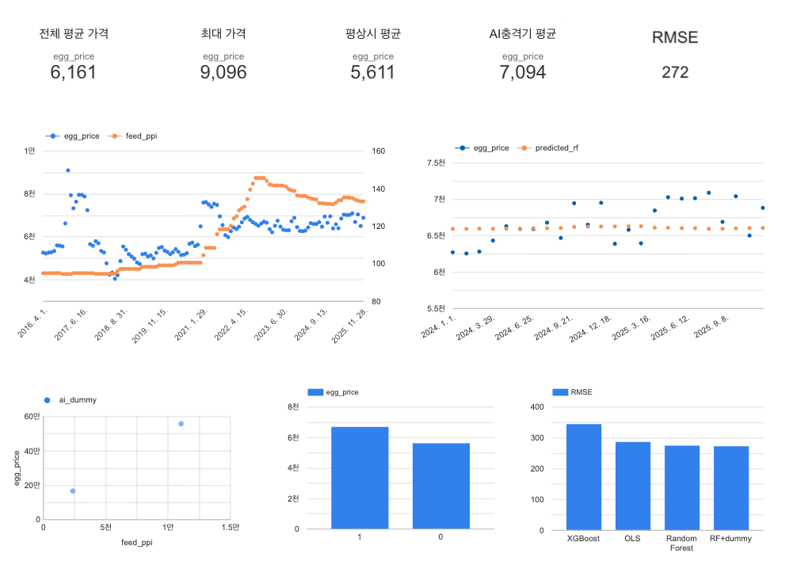

# 🥚 달걀 소매가격 변동 구조 분석

### 원가 전이 메커니즘과 외부충격 구간 식별을 통한 매입 의사결정 지원 | 2016~2025

---

## 💡 핵심 인사이트

- **사료비(feed_ppi)** 가 달걀 가격에 가장 큰 영향
  - RF 변수 중요도 feed_ppi 단독 약 36%, feed 계열 합산 약 94% / SHAP 기여값 +600원대

- **전력(electricity_ppi)** 은 elec 계열 합산 약 6%로 영향력 미미
  - OLS 음(-)의 계수는 다중공선성 왜곡으로 인과 해석 불가

- **전체 R²=0.188은 두 레짐 혼합에 의한 왜곡**
  - 평상시(n=94) R²=0.808 / AI충격기(n=23) R²=0.121로 원가-가격 연동 사실상 단절  
    -> 단순히 "변수가 부족한 모델"이 아니라  
     **"외부충격 시 가격 결정 구조 자체가 달라지는 레짐 전환 문제"** 로 해석

---

## 📌 프로젝트 개요

달걀은 국민 필수 식품으로 2016~2025년 AI 대란 및 원자재 급등 등으로 가격 변동이 반복됐습니다.

**핵심 질문**

> 사료비 및 에너지 원가가 오르면 달걀 소매가격은 얼마나 영향을 미치는가?  
> 외부충격이 발생할 때 원가-가격 전이 구조는 어떻게 바뀌는가?

---

## 🏗️ 데이터 파이프라인 아키텍처

```text
CSV / XLS Raw Data
        ↓
pandas ETL (01_data_collection)
        ↓
PostgreSQL via SQLAlchemy (Docker)
        ↓
EDA (02_eda)
        ↓
Feature Engineering (SQL JOIN & LAG) (03_sql)
        ↓
Modeling / SHAP / Regime Analysis (04_modeling)
        ↓
Dashboard (예정)

```

**데이터 저장소 마이그레이션**

본 프로젝트는 초기 SQLite 기반 분석 환경에서 시작했으며,  
확장성과 구조화된 데이터 처리 환경 구축을 위해 PostgreSQL 기반으로 마이그레이션을 진행했습니다.

구성 내용:

- Docker Compose 기반 PostgreSQL 환경 구축
- SQLAlchemy + psycopg 기반 DB 연결 관리
- notebook 기반 ETL 파이프라인 유지
- 향후 API 및 Dashboard 연동 가능한 구조 설계

---

## 📁 프로젝트 구조

```

egg_price_analysis/
├── data/
│ ├── raw/ # 원본 데이터
│ └── processed/ # 전처리 완료 데이터 (마스터 테이블)
├── notebooks/
│ ├── 01_data_collection.ipynb # ETL 파이프라인
│ ├── 02_eda.ipynb # 탐색적 데이터 분석
│ ├── 03_sql_analysis.ipynb # SQL JOIN·LAG 변수 생성
│ └── 04_modeling.ipynb # 머신러닝 모델링·가설 검증
├── output/
│ └── figures/ # 시각화 결과물
├── src/
│ └── db/
│ └── connection.py # PostgreSQL 연결 관리
├── requirements.txt
└── README.md

```

---

## 🗂️ 데이터 출처

| 데이터                     | 출처                    | 수집 방법     | 기간      |
| -------------------------- | ----------------------- | ------------- | --------- |
| 달걀 소매가격              | KAPE (축산물품질평가원) | XLS 직접 수집 | 2016~2025 |
| 양계용배합사료 PPI         | ECOS (한국은행)         | CSV 직접 수집 | 2016~2025 |
| 산업용전력 PPI             | ECOS (한국은행)         | CSV 직접 수집 | 2016~2025 |
| 달걀 생산자·소비자물가지수 | ECOS (한국은행)         | CSV 직접 수집 | 2016~2025 |

---

## 🔬 가설 및 검증 결과

| 가설                                                        | 결과          | 핵심 근거                                             |
| ----------------------------------------------------------- | ------------- | ----------------------------------------------------- |
| H1: 사료비는 시차 없이 달걀 소매가격과 가장 강하게 연동된다 | 채택 (조건부) | lag0 r=0.451 최고점, 시차 증가 시 단조 감소 확인      |
| H2: 전력보다 사료비의 영향력이 더 크다                      | 채택          | RF feed계열 중요도 94% vs elec계열 6%, SHAP 동일 방향 |
| H3: 외부충격 시기에는 원가 외 요인이 가격을 지배한다        | 채택          | AI충격기 feed 상관 -0.141 vs 평상시 0.893             |

**핵심 해석**
전체 기간 단일 모델에서는 설명력이 낮게 나타났지만

- 평상시: 원가 기반 설명력 높음
- AI 충격기: 수급, 정책, 심리 요인 우세

> 즉 "원가 변수 자체가 약한 것이 아니라 외부충격 시 가격 형성 메커니즘이 전환된다"

---

## 🤖 모델 성능 비교

| 모델                   | RMSE      | MAE       | 비고             |
| ---------------------- | --------- | --------- | ---------------- |
| OLS 다중회귀분석       | 286원     | 226원     | 베이스라인       |
| Random Forest          | 274원     | 229원     | 원가 피처만      |
| XGBoost                | 344원     | 281원     | 과적합 경향 확인 |
| RF + ai_dummy + regime | **272원** | **228원** | 최종 모델        |

> train: 2016.04 ~ 2023.12 / test: 2024.01 ~ 2025.12 (시간순 분할)  
> 평상시 기준 오차율 약 4.1% 수준으로 다음 달 가격 방향성 판단에 활용 가능

---

## 📊 비즈니스 활용 시나리오

| 시나리오          | 조건                                             | 활용                            |
| ----------------- | ------------------------------------------------ | ------------------------------- |
| 저점 매입 판단    | `소매가 ≤ 6,597원 AND ai_dummy=0`                | 원가 하한선 근접 시 매입 검토   |
| 이상 신호 감지    | `절대값(실제가 - 예측가) > 550원 AND ai_dummy=0` | 수급 이상 조기 감지             |
| AI파동 체크리스트 | 사료비 안정 + 가격 급등                          | 원가 모델 -> 수급 모니터링 전환 |

---

## 📊 대시보드

[Looker Studio 대시보드 바로가기](https://datastudio.google.com/s/hVLPC8XgNEM)


---

## 🛠️ 기술 스택

| 구분            | 기술                               |
| --------------- | ---------------------------------- |
| Language        | Python 3.12                        |
| Database        | PostgreSQL                         |
| Infrastructure  | Docker Compose                     |
| DB Connection   | SQLAlchemy, psycopg                |
| ETL             | pandas, SQL                        |
| SQL             | INNER JOIN, LAG, CASE WHEN         |
| Modeling        | statsmodels, scikit-learn, XGBoost |
| Explainability  | SHAP                               |
| Visualization   | matplotlib, seaborn                |
| Dashboard       | Looker Studio                      |
| Version Control | Git, GitHub                        |

---

## ⚙️ 실행 방법

```bash
# 1. 레포지토리 클론
https://github.com/chlnaa/egg-price-analysis

# 2. 가상환경 생성 및 활성화
python3.12 -m venv venv
source venv/bin/activate  # Mac/Linux

# 3. 패키지 설치
pip install -r requirements.txt

# 4. 환경변수 설정
cp .env.example .env
# .env 파일에 DB 정보 입력

# 5. Docker로 PostgreSQL 실행
docker compose up -d

# 6. 노트북 순서대로 실행
# 01_data_collection -> 02_eda -> 03_sql_analysis -> 04_modeling
```

---

## 📈 주요 분석 포인트

- SQL 기반 시차 변수(LAG) 생성
- Regime 분리 기반 모델링
- Random Forest 변수 중요도 분석
- SHAP 기반 변수 기여도 해석
- Time-series split 기반 평가
- 원가-가격 전이 구조 해석

---

## 📝 한계점 및 발전 방향

**한계점**

- OLS 잔차 자기상관 존재 (Durbin-Watson=0.254)
- 원가 변수만으로 단기 등락 설명 한계 존재
- 공급측 변수 확보 제한
  - 산란계 사육수
  - 살처분 규모
  - 재고량 데이터 부재

**발전 방향**

- FastAPI 기반 데이터 API 구축
- Streamlit Dashboard 개발
- 지역별 가격 시각화 추가
- 공급측 데이터 연동
- 시계열 모델(ARIMA, LSTM) 적용
- Airflow 기반 배치 파이프라인 검토

---

## 📌 프로젝트 의의

본 프로젝트는 단순 가격 예측을 넘어:

- 원가 전이 메커니즘 분석
- 외부충격 구간 구조 변화 해석
- 데이터 저장소 마이그레이션
- Docker 기반 분석 환경 구축

을 통해
"분석 가능한 데이터 파이프라인 구축"에 초점을 맞췄습니다.
